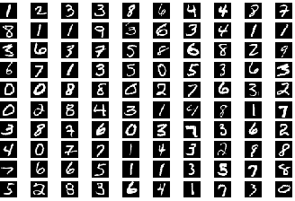

# Deep Neural Networks

## Contents

* [Background](#background)
  * [Deep neural networks](#deep-neural-networks)
  * [SDRAM](#sdram)
* [Design](#design)
  * [Task 1: System, PLL, and SDRAM controller](#task-1-system-pll-and-sdram-controller)
  * [Task 2: A memory copy accelerator](#task-2-a-memory-copy-accelerator)
  * [Task 3: A deep neural network accelerator](#task-3-a-deep-neural-network-accelerator)
  * [Task 4: Bonus](#task-4-bonus)
  * [Memory Map](#memory-map)
  * [Test inputs](#test-inputs)
* [Deliverables and Evaluation](#deliverables-and-evaluation)

## Background

In this lab, you will build a deep neural network accelerator for an embedded Nios II system. You will also learn how to interface with off-chip SDRAM, and how to use a PLL to generate clocks with specific properties.

### Deep neural networks

We will use a type of neural network called a multi-layer perceptron (MLP) to classify the MNIST hand-written digit dataset. That is, our MLP will take a 28×28-pixel greyscale image as input and determine which digit (0..9) this image corresponds to.

An MLP consists of several linear layers that first multiply the previous layer's outputs by a weight matrix and add a constant “bias” value to each output, and then apply a non-linear activation function to obtain the current layer's outputs (called activations). Our MLP will have a 784-pixel input (the 28×28-pixel image), two 1000-neuron hidden layers, and a 10-neuron output layer; the output neuron with the highest value will tell us which digit the network thinks it sees. For the activation function, we will use the rectified linear unit (ReLU), which maps all negative numbers to 0 and all positive numbers to themselves.

During inference, each layer computes _a'_ = ReLU(_W_·_a_+_b_), where _W_ is the weight matrix, _a_ is the vector of the prior layer's activations, _b_ is the bias vector, and _a'_ is the current layer's activation vector. You might find [3Blue1Brown's neural network video](https://www.youtube.com/watch?v=aircAruvnKk) an excellent introduction to how the math works.

Do not be discouraged by fancy terms like neural networks. You are essentially building a matrix-vector multiply accelerator, which you already did in the previous lab! Most of the challenge here comes from interacting with the off-chip SDRAM memory and correctly handling signals like _waitrequest_ and _readdatavalid_.

You don't need to know how these networks are trained, since we have trained the network for you and pre-formatted the images (see the contents of the `data` folder, and the [list of test inputs](#test-inputs)). If you are curious, however, you can look in `scripts/train.py` to see how we trained the MLP.

We will use **signed Q16** fixed-point numbers to represent all biases, activations, etc.

### SDRAM

Unlike in prior labs, where we only used on-chip memory, you will use the off-chip SDRAM chip on your DE1-SoC board. Because DRAM is more complicated to use directly than SRAM — for example, it stores values in capacitors, which lose charge over time and must be refreshed — it needs an SDRAM controller. Luckily for you, Platform Designer can build one for you and connect it to the Avalon interconnect, at which point the SDARM behaves like a normal Avalon memory-mapped slave.

Because SDRAM timing needs to be very precise, you will also have to generate a phase-locked loop (PLL). We have discussed PLLs in lecture — they allow you to use a source “reference” clock to generate clocks with different frequencies and phases. We will need one clock to feed to our system, and another to feed to the SDRAM chip.

## Design

The reset in this lab is an active-low asynchronous reset. All other signals in are active-high, and all sequential elements are triggered on the posedge of the clock.

### Task 1: System, PLL, and SDRAM controller

First, create a Nios II system using Platform Designer, like in Lab 5. For the CPU, choose the Nios IIe (the cheap and cheerful version). You will also need a JTAG module to interface with the Monitor Program. Call the system `dnn_accel_system` and refer to the [memory map](#memory-map) for the address ranges of all components.

#### PLL

Next, add a phase-locked loop (PLL) IP to your system. Set up your PLL to have a 50MHz reference clock and two output clocks:

- `outclk0`, a 50MHz clock with phase shift of 0ps, which will drive most of our design
- `outclk1`, a 50MHz clock with phase shift of -3000ps, which will connect to the SDRAM chip (this accounts for things like the wiring between the FPGA and the SDRAM)

Also, enable the PLL locked output. Leave all other settings at their default values.

In Platform Designer, Export `outclk1` as `sdram_clk` and the `locked` signal as `pll_locked`. Connect the `refclk` input to the PLL to the default clock source (`clk_0.clk`) and the `reset` input to the PLL to the default reset source (`clk_0.clk_reset`). **Do not** connect the PLL's reset to the debug master — otherwise your system will lose the clock every time the Monitor program tries to reset your CPU! Connect `outclk0` as the clock input to all other modules except for `clk_0` — this includes the CPU, the SDRAM controller, and all other modules you will add later.

#### SDRAM controller

Next, add an SDRAM controller to your system. To match the SDRAM on the DE1-SoC, you will need to use the following settings when generating the controller:

|  parameter   |   setting  |
| ------------ | ---------- |
| data width   | 16 bits    |
| row width    | 13 bits    |
| column width | 10 bits    |
| refresh      | 7.8125µs   |
| t_rp         | 15.0ns     |
| t_rcd        | 15.0ns     |
| t_ac         | 5.4ns      |
| base address | 0x08000000 |

Leave all other settings at their default values.

Export the `wire` conduit interface of the controller as `sdram`; these are the signals you will connect to the FPGA pins that go to the off-chip SDRAM.

#### Output PIO

Finally, add a parallel I/O (PIO) module with a 7-bit output port and reset value 0x7f. Export this port as `hex` — we will use it to display the recognized digit.

#### The rest

We have provided a toplevel `task1.sv` for you, which instantiates your system and connects it to the SDRAM and the 7-segment display. We have also provided `run_nn.c`, the C file you will use to test your system. (Isn't that refreshing?)

After synthesizing your design, we will use the FPGA Monitor Program to run some code. Before doing so, however, we have to tell it to leave some of the address space empty so we can use it to load the neural network weights and test images. (Otherwise, the linker will assume that the entire memory belongs to the program, which is a little inconvenient to work around.)

To do this, examine the _Memory settings_ tab When creating the FPGA Monitor project. You will see that the memory contains one section called `.text`; change that section's address range to 0x08000000-0x09ffffff. Next, add another section called `.nndata`, and set it to address range 0x0a000000-0x0bffffff. Now you can download your `.sof` to the FPGA and compile and load `run_nn.c`.

After compiling and loading the program, you will also need to download the neural network's weights and an input image to the off-chip memory. You can do this by choosing _Actions&rarr;Load file into memory_. Specifically, load the following as _binary files_:

- `nn.bin` at address 0x0a000000 (this will take a bit of time)
- one of the test images (e.g., `test_00.bin`) at address 0x0a800000 (this is quick)

Finally, you can run the file to evaluate the neural network on the input image. On a DE1-SoC, inference takes about 7 minutes (!) with optimization level -O0 and a little under 6 minutes with optimization level -O2.

This task is marked only during the demo: you will need to show that you can run the neural net on one of the test inputs — the TA will tell you which of the test images to load (or possibly give you a new input). Because running the net takes several minutes, set a breakpoint at `run_nn.c:80` (the last call to `apply_layer()`), let the program run while the TA is talking to other students, and run the rest when the TA comes back to you.

#### Tips

You can use `xxd nn.bin | less` on Mac/Linux or `format-hex nn.bin | out-host -paging` in Windows Powershell to examine binary files, and check that you loaded them correctly under the _Memory_ tab of the Monitor Program. Note that the files themselves are in _little-endian_ byte order but both `xxd` and `format-hex` show them as _big-endian_ while the Monitor shows them as _little-endian_.

Don't accidentally connect the debug reset to the PLL. If you do, the Monitor program will reset the PLL (and lose all clocks) every time it tries to reset the CPU, and you will never be able to run anything.

### Task 2: A memory copy accelerator

Design an IP component that copies a range of words from one address in SDRAM to another. It will have an Avalon memory-mapped slave interface (to accept commands from the CPU) and an Avalon memory-mapped master interface (to interact with the SDRAM). Such capability is often called DMA copy, the point being to do the memory transfer without involving the CPU, which presumably could be doing something more interesting in parallel.

To start the copying process, the processor will first set up the transfer by writing the byte address of the destination range to word offset 1 in the accelerator's address range, the source byte address to word offset 2, and the number of 32-bit words to copy to word offset 3. Next, the CPU will write any value to word offset 0 to start the copy process. Finally, the CPU will read offset 0 to make sure the copy process has finished. In a nutshell:

| word |                       meaning                      |
| ---- | -------------------------------------------------- |
|   0  | when written, starts accelerator; may also be read |
|   1  | destination byte address                           |
|   2  | source byte address                                |
|   3  | number of 32-bit words to copy                     |

If offsets 1, 2, or 3 are not changed between two writes to offset 0, they keep their previous values; that is, the user should be able to change only the destination address to make multiple copies of the same source data, and so on.

All of the pointers will be byte addresses, but they will be aligned on 32-bit boundaries (i.e., your core does not need to handle unaligned accesses). Conveniently, the SDRAM controller also operates with byte addresses. The `run_nn.c` file contains some code you can run to test your accelerator.

Refer to the [memory map](#memory-map) for this accelerator's address range.

Make sure you understand the functions of _readdatavalid_ and _waitrequest_ that are part of the master interface; they are documented in the Avalon spec. In particular, the SDRAM controller may not respond to read requests immediately — for example, it could be busy refreshing the DRAM or opening a new row — so you will have to ensure that you don't read bogus data or read/write when the SDRAM controller cannot accept new requests. Conversely, observe that there is no _readdatavalid_ on the slave interface.

Also note how the CPU ensures the copy process has finished: it _reads_ offset 0 in your device's address range. This means that you must arrange for this access to _stall_ until the copy is complete. Make sure you understand how _waitrequest_ works. Also, your accelerator must be able to handle repeated requests, so make sure it does not lock up after handling one request.

You will find the module skeleton in `wordcopy.sv`, and your testsuite will go in `tb_wordcopy.sv`. Note that you will have to mock any modules required to thoroughly test your design, including the SDRAM controller interface.

To demo this task, you will need to demonstrate that you can copy any number of words (obviously fewer than 232) from one location in memory to another using your accelerator.

Fun fact: a slightly more sophisticated version of this accelerator (i.e., one that supports unaligned accesses and bitmasks) is called a _blitter_. Blitter hardware was used to accelerate graphics processing, originally in the Xerox Alto computer and later in the Commodore Amiga and arcade games.

### Task 3: A deep neural network accelerator

In this task, you will design a deep neural network accelerator core. This sounds fancy but is basically a vector-vector dot product accelerator that computes the inner product _w_·_a_, adds a bias _b_, and optionally applies the ReLU activation function to the result. And you've already built a similar module in the previous lab!

The main difference from previous labs is that our core will receive memory addresses where the weights, biases, and activations are located, rather than being given values directly. This means that it will need to make memory requests using the Avalon memory-mapped master interface. But, you've also already done something very similar in _two_ previous labs!

To set up the computation, the CPU will write addresses of the bias vector, weight matrix, input and output activations, and the input activation vector length to the following word offsets in your component's address range:

| word |                       meaning                      |
| ---- | -------------------------------------------------- |
|   0  | when written, starts accelerator; may also be read |
|   1  | bias vector byte address                           |
|   2  | weight matrix byte address                         |
|   3  | input activations vector byte address              |
|   4  | output activations vector byte address             |
|   5  | input activations vector length                    |
|   6  | _reserved_                                         |
|   7  | activation function: 1 if ReLU, 0 if identity      |

It will also write 1 to word offset 7 if the ReLU activation function is to be used after the dot product has been computed, or 0 if no activation function is to be applied.

As with the word copy accelerator, you must use _waitrequest_ appropriately to stall subsequent memory accesses to your accelerator's address range until the dot product computation (and possibly the activation) is finished.

Your component must handle multiple requests; otherwise you won't be able to use it repeatedly to compute the full matrix-vector product. If offsets 1–7 are not changed between two writes to offset 0, they keep their previous values; for example, the user should be able to set the input activations address and the input activations vector length once and make several request to your component.

All weights, biases, and activations here are in **signed Q16 fixed point**. Make sure you account for this appropriately when multiplying numbers.

You will find the module skeleton in `dnn.sv`, and your testsuite will go in `tb_dnn.sv`. Note that you will have to mock any modules required to thoroughly test your design, including the SDRAM controller interface. The `run_nn.c` file we provided already contains a function that uses your accelerator to compute a matrix-vector product.

To demo this task, you will need to classify an input provided by the TA, except using your accelerator hardware (which should take a few seconds at most).

### Task 4: Bonus

As written, your accelerator is limited by reading the memory. There are several ways to improve the situation — we are actually not saturating the memory bandwidth but rather accessing the memory inefficiently — but we will focus on one for the bonus task.

Observe that, in `run_nn.c`, each element of the input activations vector is read as many times as there are output activations. If we instead store this vector inside our accelerator and reuse it to compute many output activations, we will have saved ourselves a lot of accesses to off-chip SDRAM.

The problem is that the input activations vector could be very large — in our toy network we have 1,000 at most, but in general it could be much, much longer, so you might not be able to store the entire thing within your accelerator. To solve this challenge, you will need to keep only a _part_ of the input activations vector — at most 64 entries — at a time.

If you think about what it means to reuse 64 input activations at a time, you will quickly discover that you need some place to store partial sums. Storing them in off-chip SDRAM is a lousy idea because SDRAM accesses are exactly what we're trying to limit in the first place. On the other hand, if you want to store them in your component, you will quickly run into the same problem of not knowing how large the output activations vector will be. We will therefore also limit this to 64 output activations at a time.

To do this, we will need to slightly alter the DNN accelerator interface. It will now also accept the length of the partial output activations vector we are working on at the moment — at most 64 but possibly smaller (e.g., if the total vector length is not divisible by 64). We will use the previously reserved word offset in the accelerator's address space:

| word |                       meaning                      |
| ---- | -------------------------------------------------- |
|   6  | partial output activations vector length           |

Otherwise the interface is the same as in the baseline DNN accelerator above.

To complete this task, you will need to implement this design. In particular, you will need to load each input activation exactly once for the specified number of partial vector of output activations (e.g., 64).

You will find the module skeleton in `bonus.sv`, and your testsuite will go in `tb_bonus.sv`. As before, you will have to mock any modules required to thoroughly test your design, including the SDRAM controller interface. Because we did not provide the C code for this accelerator version in `run_nn.c`, you will have to copy `run_nn.c` to the `bonus` folder and implement `apply_layer_acc_bonus()` with the same prototype as `apply_layer_acc()` but using your bonus accelerator version.

### Memory Map

| Component               |    Base    |    End     |
| ----------------------- | ---------- | ---------- |
| Nios II debug mem slave | 0x00000800 | 0x00000fff |
| JTAG UART               | 0x00001000 | 0x00001007 |
| PIO (7-segment display) | 0x00001010 | 0x0000101f |
| Word-copy accelerator   | 0x00001040 | 0x0000107f |
| DNN accelerator         | 0x00001080 | 0x000010bf |
| DNN accelerator (bonus) | 0x000010c0 | 0x000010ff |
| SDRAM controller        | 0x08000000 | 0x0bffffff |

### Test inputs

The files `test_00` through `test_99` correspond to the following images:

## Deliverables and Evaluation

### Automatic testing

We will be marking your code via an automatic testing infrastructure. Your autograder marks will depend on the fraction of the testcases your code passed (i.e., which features work as specified), and how many cases your testbenches cover.

It is essential that you understand how this works so that you submit the correct files — if our testsuite is unable to compile and test your code, you will not receive marks.

The testsuite evaluates each task separately. For each design task folder (e.g., `task3`), it collects all Verilog files (`*.sv`) that do not begin with `tb_` and compiles them **all together**. Separately, each required `tb_*.sv` file is compiled with the relevant `*.sv` design files. This means that

1. You must not **rename any files** we have provided.
1. Your testbench files must begin with `tb_` and **correspond to design file names** (e.g., `tb_foo.sv` for design `foo.sv`).
1. You must not have **multiple copies of the same module** in separate committed source files in the same task folder. This will cause the compiler to fail because of duplicate module definitions.
1. Your modules must not **rely on files from another folder**. The autograder will only look in the relevant task folder.

To test your design, the autograder will instantiate and test each module exactly the way it is defined in the provided skeleton files. This means that
1. You must not **alter the module declarations, port lists, etc.**, in the provided skeleton files.
1. You must not **rename any modules, ports, or signals** in the provided skeleton files.
1. You must not **alter the width or polarity of any signal** in the skeleton files (e.g., everything depending on the clock is posedge-triggered, and `rst_n` must remain active-low).

To check your test coverage, the autograder will collect all `*.sv` files (including `tb_*.sv`) and instantiate the relevant `tb_` file and nothing else. This means that you need to mock any modules that your code interacts with, including the SDRAM controller.

If your code does not compile and simulate under these conditions (e.g., because of syntax errors, misconnected ports, or missing files), you will receive **0 marks**. If your code does not synthesize using Quartus, your marks will be reduced.

### Marks

The evaluation of your submission consists of two parts:
- the TA demo, worth 30%, and
- the autograder tests of your code and testbenches, worth 70%

(Task 1 requires that you demonstrate your simulation to receive any marks; see below).

### Task 1 [1 mark]

- `dnn_accel_system.qsys`
- `dnn_accel_system.sopcinfo`
- the `dnn_accel_system` folder and its subfolders

To obtain any credit for this task, you must demonstrate to the TA that you have correctly built the system and can run the software DNN inference code from `run_nn.c`.

### Task 2 [4 marks]

- `wordcopy.sv` and the rest of your design
- `tb_wordcopy.sv` and any other testbench files

### Task 3 [5 marks]

- `dnn.sv` and the rest of your design
- `tb_dnn.sv` and any other testbench files

### Task 4 [BONUS]

- `dnn_bonus.sv` and the rest of your design
- `tb_dnn_bonus.sv` and any other testbench files
- a suitably modified `run_nn.c`

